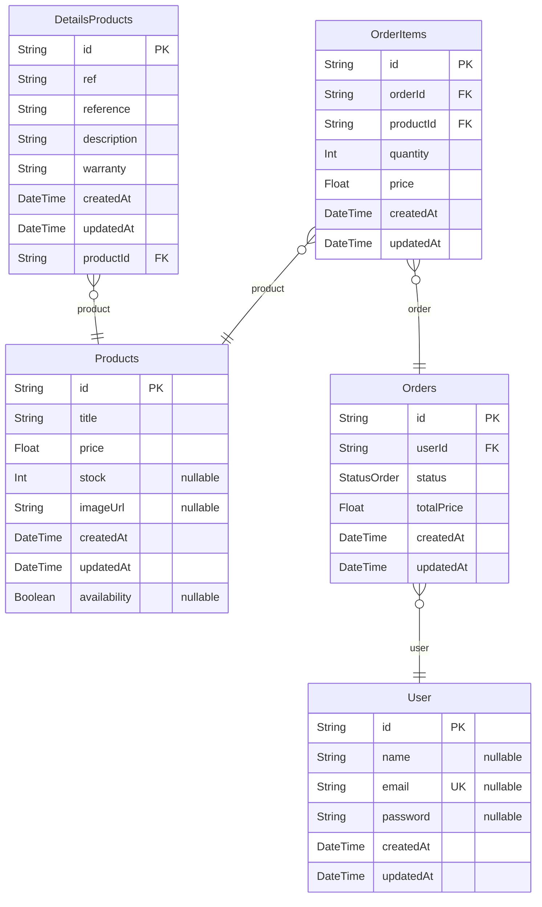

# Tech Store With DfViate
> Generated by [`prisma-markdown`](https://github.com/samchon/prisma-markdown)

- [default](#default)

## default

### `User`

**Properties**
  - `id`: 
  - `name`: 
  - `email`: 
  - `password`: 
  - `createdAt`: 
  - `updatedAt`: 

### `DetailsProducts`

**Properties**
  - `id`: 
  - `ref`: 
  - `reference`: 
  - `description`: 
  - `warranty`: 
  - `createdAt`: 
  - `updatedAt`: 
  - `productId`: 

### `Products`

**Properties**
  - `id`: 
  - `title`: 
  - `price`: 
  - `stock`: 
  - `imageUrl`: 
  - `createdAt`: 
  - `updatedAt`: 
  - `availability`: 

### `Orders`

**Properties**
  - `id`: 
  - `userId`: 
  - `status`: 
  - `totalPrice`: 
  - `createdAt`: 
  - `updatedAt`: 

### `OrderItems`

**Properties**
  - `id`: 
  - `orderId`: 
  - `productId`: 
  - `quantity`: 
  - `price`: 
  - `createdAt`: 
  - `updatedAt`: 